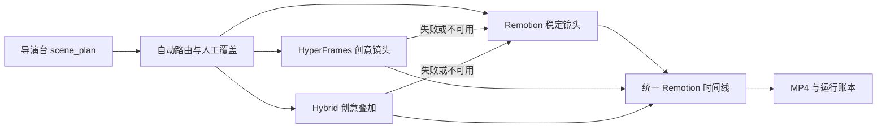

# V0.4 本地智能执行内核

V0.4 的目标是让 any2video 能嵌入本地生产工作流：导演决定表达，执行内核选择和调用能力，所有中间产物与运行状态都可审计、可重试。

## 运行模型



## 镜头契约

每个 `scene_plan.json` 镜头包含：

- `renderer`: `auto | remotion | hyperframes | hybrid`，代表导演请求。
- `engine.requested`: 规范化后的请求。
- `engine.resolved`: 实际选中的执行策略。
- `engine.reason`: 可直接展示给导演的选择原因。
- `engine.status`: `pending | prepared | ready | fallback`。
- `engine.artifact`: 创意源码、brief、manifest 或 MP4 信息。
- `engine.last_run_id` / `engine.error`: 最近执行和回退依据。

自动路由当前遵循：首镜与收束镜优先 HyperFrames；流程、步骤、机制与结构解释优先 Hybrid；金额、处罚、合规和高风险事实优先 Remotion；一般内容使用 Remotion。人工选择始终优先。

## 本地目录

```text
video_workspace/projects/<project_id>/
  scene_plan.json
  runs/run-*.json

ppt_course_renderer/render_tasks/v2-<project_id>/
  creative_assets/<scene_id>/
    DESIGN.md
    creative_brief.json
    index.html
    asset_manifest.json
    clip.mp4              # HyperFrames 成功后存在

ppt_course_renderer/public/v2_creative/<project_id>/<scene_id>/clip.mp4
```

## 能力与安全回退

`GET /api/v2/capabilities` 与 `any2video capabilities` 会检测本机 Remotion、HyperFrames、FFmpeg 和 FFprobe。默认不会在 Web 请求中自动安装外部工具；HyperFrames 不可用时保留 HTML 场景源并标记 `fallback`，Remotion 继续生成最终视频。

若明确允许按需执行，可使用下列命令。macOS 检测到系统 Chrome 时会直接复用，避免重复下载渲染浏览器：

```bash
any2video prepare-scenes <project_id> --execute --allow-on-demand
```

## API

- `GET /api/v2/capabilities`
- `GET /api/v2/projects/{project_id}/runs`
- `POST /api/v2/projects/{project_id}/creative-scenes/prepare`
- `POST /api/v2/projects/{project_id}/scenes/{scene_id}/prepare`
- `POST /api/v2/projects/{project_id}/render`

`prepare` 请求体为 `execute`、`allow_on_demand`、`timeout_sec`。最终 `render` 会先完成路由与创意镜头准备，再生成统一 props，并由 Remotion 装配最终时间线。
